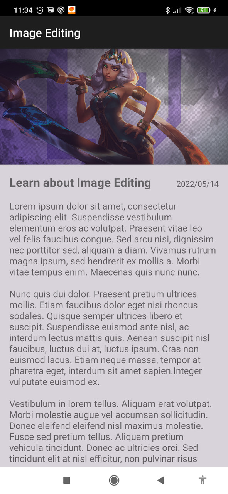
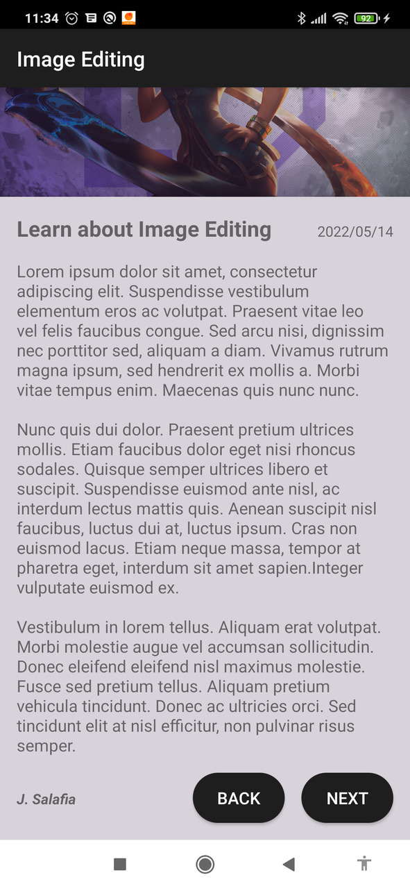

# Android Studio Course
The course has about 107 hours of content, the main goal is to push an exercise per day.

## Layout with Scroll View

In this exercise I made my first layout with scroll view.

  
   

---

### Tools

- [Java](https://www.java.com/pt-BR/)
- [Android Studio 3.5](https://developer.android.com/studio?hl=pt-br)

### Setup

You can download the repository and run inside Android Studio 3.5+
